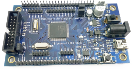
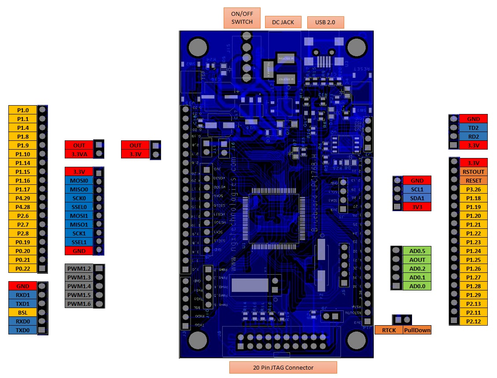
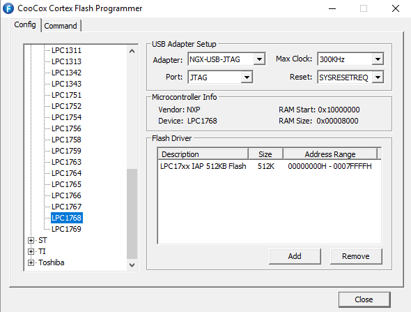
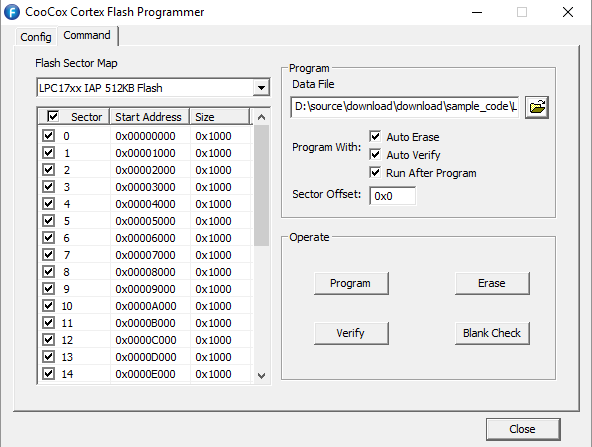

# NGX Blueboard-LPC1768-H board support for Mbed OS
## Pinout Diagram:

## Buy Below:
* [Japan](http://akizukidenshi.com/catalog/g/gM-06543/)
* [Other Countries](https://ngxkart.com/collections/blueboard/products/blueboard-lpc1768-h)

# Features
* mbed enabled
    * Easy to use C/C++ SDK
    * Handy libraries
* 20 pin JTAG/SWD programming connector
* USB device interface
* NXP LPC1768 MCU
    * Powerful ARM Cortex-M3 core
    * Up to 100MHz
    * 512KB Flash, 64KB RAM 
    * Ethernet, USB Host/Device, 4xUART, 3xI2C, 2xSPI

# External tools dependencies
* Install [Python 2.7.18](https://www.python.org/downloads/release/python-2718/) or [above](https://www.python.org/downloads/release/python-383/) and add to PATH
* Install [pip](https://www.liquidweb.com/kb/install-pip-windows/) and add to PATH (Ex: **c:/python27/scripts** in windows)
* Install [gcc-arm-none-eabi](https://developer.arm.com/tools-and-software/open-source-software/developer-tools/gnu-toolchain/gnu-rm/downloads)
* install [Git](https://git-scm.com/download/win) and add to PATH

#### Project Setup:
* open Git bash
* git clone --recursive https://github.com/vvkaggarwal12/mbed-ngx-lpc1768-header.git
* cd mbed-ngx-lpc1768-header
* pip install -r mbed-os/requirements.txt
* python mbed-os/tools/make.py -t GCC_ARM -m NGX_BLUEBOARD_LPC1768_H --source . --build ./build
* bin files will be generated in the **build** folder i.e. **mbed-ngx-lpc1768-header.bin**
* The bin files can be flashed using [CoFlash](./tools/CoFlash-1.4.8.exe)

### Mbed OS version support
 
| Bluepill          | Mbed OS  (hash)                           | Status              |
| ----------------- | ----------------------------------------- | ------------------- |
| preview           | ([#latest](https://github.com/ARMmbed/mbed-os/tree/latest))                     | Compiles and runs ok         |

### Documents
* [Schematic](./docs/schematics/Blueboard_lpc1768H-V2.pdf)

### Programming with CoFlash programming utility
Blueboard LPC1768 Header can be programmed using standard **20-pin JTAG or SWD** interface connector using any standard JTAG adapter.

<!-- ###### Replace TARGET with below name while building:

* Blueboard LPC1768 Header : NGX_BLUEBOARD_LPC1768_H 
* LPC1768 Xplorer : NGX_LPC1768_Xplorer -->
